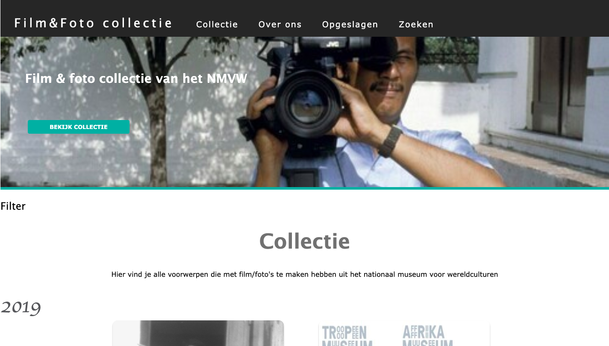

# applicatie-filmliefhebbers
* [De applicatie](https://voorwerpen-nwcm.herokuapp.com/collectie)


## Concept

### Doelgroep: 
Film en fotografie liefhebbers die het interessant vinden om objecten die te maken hebben met fotografie en film te bekijken uit de collectie van het NMWC (Nationaal Museum van wereldculturen).

De website (Film en foto collectie) geeft een inkijk in de collectie van het NMWC en laat alle objecten gemakkelijk zijn die te maken hebben met film en fotografie.

### Features
* De website biedt gebruikers de mogelijkheid om informatie op te halen over oude objecten die te maken hebben met video en fotografie.
* Bij elk object zie je te titel en de afbeelding van het voorwerp. Als je dan meer wilt weten over een voorwerp kun je naar de detailpagina gaan.
* Als je klikt op lees meer bij een voorwerp tussen de collectie, wordt je gestuurd naar de detailpagina van het object waar je op geklikt hebt. Deze detailpagina staat op de website van het nationaal museum van wereldculturen. Hier vind je meer informatie over een voorwerp zoals omschrijving, titel, link naar de officiele website van het MMWC en de afbeelding.

### Wishlist:
Wat ik graag nog zou willen toevoegen aan de applicatie is het volgende:
*  Als je op de site komt, is het leuk als je door de collectie kan scrollen van nieuwste voorwerpen tot oudste. je scrolt eigenlijk door de jaren heen. Zo heeft de gebruiker een leuke interactie.
* Je moet uiteindelijk  ook kunnen filteren op jaaral en categorie.
*  Ook lijkt het me interessant als je de voorwerpen die je interessant vind kunt opslaan door deze een like te geven. 
* Op de detailpagina meer informatie toevoegen, zoals:
  * Wat voor manieren zijn er toegepast tijdens het fotograferen? (Sepia en zwart-wit), wat is er bekend over de technische onderdelen van de camera's voor vroeger en nu?

## Proces
Als je meer wilt weten over mijn proces kun je de wiki bekijken
[Wiki](https://github.com/emmaoudmaijer/Frontend-applications/wiki)

## Data met SPARQL
Welke data had ik nodig voor het concept?
* Alle type objecten die te maken hebben met film/fotografie. 
* De description ophalen bij elk object als deze aanwezig is.
* Linkje naar de detailpagina van het NMWC.
* Afbeeldingen ophalen bij elk object zodat ik deze kan laten zien op mijn pagina.
```
PREFIX rdf: <http://www.w3.org/1999/02/22-rdf-syntax-ns#>
PREFIX dc: <http://purl.org/dc/elements/1.1/>
PREFIX dct: <http://purl.org/dc/terms/>
PREFIX skos: <http://www.w3.org/2004/02/skos/core#>
PREFIX edm: <http://www.europeana.eu/schemas/edm/>
PREFIX foaf: <http://xmlns.com/foaf/0.1/>
PREFIX dbo: <http://dbpedia.org/ontology/> 
SELECT ?cho ?title ?type (SAMPLE(?description) AS ?description) (SAMPLE(?picture) AS ?picture) WHERE {
  VALUES ?type { "camera" "Camera" "fotocamera" "Fotocamera" "cameratas" "cameratassen" "Cameratassen" "filmcamera" "film" "filmtassen" "sepia" "fototas" "Film" "Cameratas"}
  ?cho dc:type ?type;
  dc:title ?title;
  edm:isShownBy ?picture .
  OPTIONAL {?cho dc:description ?description} .
  FILTER langMatches(lang(?title), "ned")
}
```

## Installation

* `git clone <repository-url>` this repository
* `cd applicatie-filmliefhebbers`
* `npm install`

### Wat heb je nodig?

* [Git](https://git-scm.com/)
* [Node.js](https://nodejs.org/) (with npm)
* [Ember CLI](https://ember-cli.com/)
* [Google Chrome](https://google.com/chrome/) (optional)

## Running / Development

* `ember serve`
* Bekijk je app op [http://localhost:4200](http://localhost:4200).

### Linting

* `npm run lint:hbs`
* `npm run lint:js`
* `npm run lint:js -- --fix`

### Building

* `ember build` (development)
* `ember build --environment production` (production)

## Interessante en gebruikte bronnen

* [ember.js](https://emberjs.com/)
* [ember-cli](https://ember-cli.com/)
* Development Browser Extensions
  * [ember inspector for chrome](https://chrome.google.com/webstore/detail/ember-inspector/bmdblncegkenkacieihfhpjfppoconhi)
  * [ember inspector for firefox](https://addons.mozilla.org/en-US/firefox/addon/ember-inspector/)

## Hulp

Special thanks to Nick Meijer en Eyob voor het uitleggen van sparql en het helpen bij de detailpagina.

## Licence:
ISC [Emma Oudmaijer](https://github.com/emmaoudmaijer/Frontend-applications)